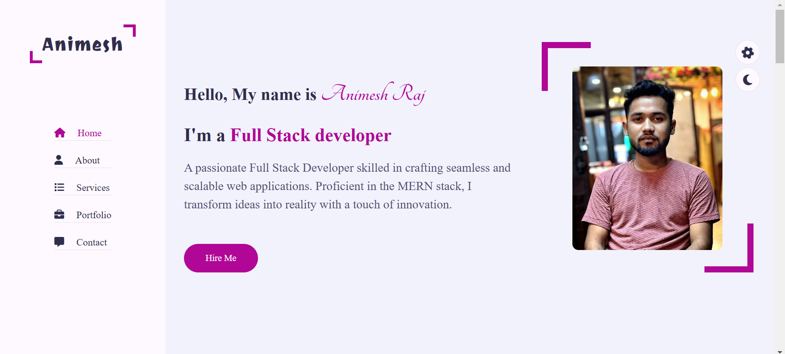
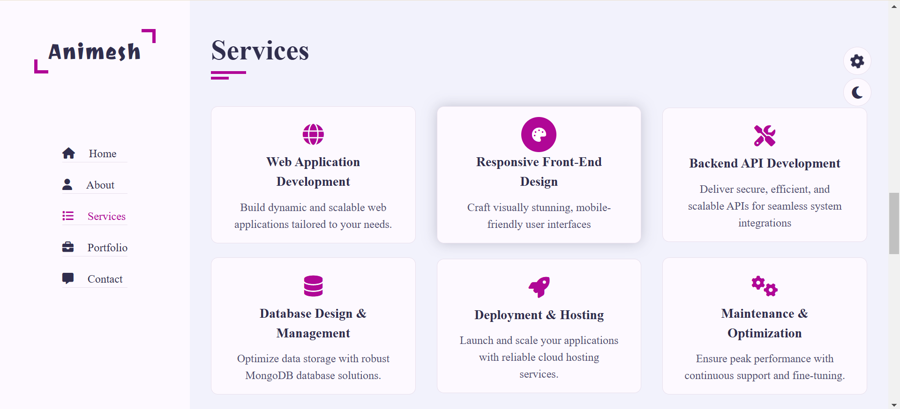

# Portfolio Website 🌟

Welcome to my personal portfolio website! This project showcases my skills, projects, and experiences as a **Full-Stack Developer** and **MERN Stack Developer**.

## 🖥️ Live Preview
Check out my portfolio live: (https://iamanimeshraj.github.io/Portfolio/)

---

## 📌 Features
- **Responsive Design**: Fully optimized for desktop and mobile devices.
- **Interactive UI**: Built with HTML, CSS, and JavaScript for a dynamic user experience.
- **Showcase of Projects**: A detailed section highlighting my best work.
- **About Me**: Information about my skills, experience, and interests.
- **Contact Section**: Includes links to my social media profiles and a contact form.

---

## 🚀 Technologies Used
- **HTML5**: For structuring the content.
- **CSS3**: For styling and responsive design.
- **JavaScript**: For interactivity and functionality.

---

## 📂 Project Structure
.
- ├── index.html        # Main HTML file
- ├── style.css         # Stylesheet for the project
- ├── script.js         # JavaScript for interactivity
- ├── assets/           # Folder for images and other assets
- └── README.md         # Documentation file
---
## 🛠️ Installation & Setup

Follow these steps to set up and run this project locally:

1. **Clone the repository**  
   Clone this GitHub repository to your local machine using the command:
   ```bash
   git clone https://github.com/iamanimeshraj/portfolio.git
2. **Navigate to the project directory**
   - Use the cd command to move into the project folder:
   ```bash
     cd portfolio
3. **Open the project**
   - Open the index.html file in your preferred web browser to view the website.

---
## 🎨 Screenshots

### 1. Home Page


### 2. Projects Section



